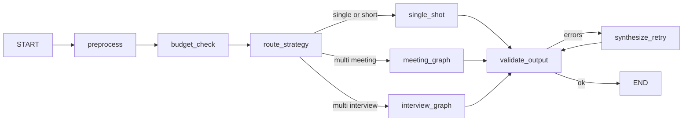

# Multi-Agent Transcript Analysis Plan (MeetPilot / HackFeed)

**Goal**: Analyze meeting and interview transcripts with higher accuracy, lower cost, and predictable latency by splitting work across specialized agents orchestrated with **LangGraph** from day one.

**Context**: Phase 2 today uses a single OpenAI call in `app/services/llm.py`. This plan replaces ad-hoc orchestration with **LangGraph `StateGraph`s** wired into `POST /api/sessions/{id}/process` — not a later refactor.

**Stack**: FastAPI · OpenAI (`gpt-4o` / `gpt-4o-mini`) · **LangGraph** · Pydantic state · existing React UI.

---

## 1. When multi-agent helps (and when it does not)

| Scenario | Single-node graph | Full LangGraph pipeline |
|----------|-------------------|-------------------------|
| Transcript &lt; ~6k tokens | ✅ `single_shot` node only | Overkill |
| Long meetings (1–3+ hours) | ❌ Misses details, JSON breaks | ✅ Map-reduce + merge |
| Interview (technical + behavioral) | ⚠️ Shallow skill tags | ✅ Parallel reviewer nodes |
| Citations / evidence per claim | Hard in one shot | ✅ Extractor nodes + quotes |
| Hackathon / MVP | ✅ Start with minimal graph | Grow nodes incrementally |

**Recommendation**: **LangGraph from Phase A** — even the “single-agent” path is one node in the same graph (`route → single_shot → validate → END`). Multi-agent is additional nodes behind `strategy=multi` or auto-routing by token count. No separate custom orchestrator to throw away later.

---

## 2. Design principles

1. **One graph framework** — All processing flows through LangGraph; FastAPI only invokes `graph.ainvoke()` / `astream()`.
2. **Preprocess once** — Deterministic `preprocess` node writes shared state (chunks, segments, meta); LLM nodes never re-parse raw text.
3. **Parallelize with LangGraph** — Use `Send` API (map-reduce) or fan-out edges for per-chunk work; merge node collects results.
4. **Model tiers** — `OPENAI_MODEL_FAST` (`gpt-4o-mini`) for narrow nodes; `OPENAI_MODEL` (`gpt-4o`) for synthesis.
5. **Structured outputs** — Each LLM node returns JSON validated with Pydantic; invalid JSON triggers conditional retry edge.
6. **Checkpointing (optional Phase D)** — `MemorySaver` or Postgres checkpointer for long jobs and resume.
7. **Budget guardrails** — `budget_check` node before any LLM fan-out; abort with HTTP 413 if over limit.

---

## 3. High-level architecture

```
┌──────────────────────────────────────────────────────────────┐
│  FastAPI  POST /api/sessions/{id}/process                     │
│  strategy: single | multi | auto                              │
└────────────────────────────┬─────────────────────────────────┘
                             │ graph.ainvoke(initial_state)
┌────────────────────────────▼─────────────────────────────────┐
│  LangGraph — TranscriptAnalysisGraph (parent)                 │
│                                                               │
│  START → preprocess → route_strategy → … → validate → END   │
│              │              │                                 │
│              │         ┌────┴────┐                          │
│              │         ▼         ▼                          │
│              │   single_shot   subgraph: meeting | interview  │
│              │   (1 LLM node)   (map-reduce pipelines)        │
└──────────────────────────────────────────────────────────────┘
                             │
                    app/services/llm.py
                    (OpenAI client, model_tier)
```

**Parent graph** handles: ingest state, preprocessing, routing, quality gate, persistence callback.

**Child graphs** (`meeting_graph`, `interview_graph`) encapsulate mode-specific map-reduce and synthesis.

---

## 4. LangGraph state model

```python
# app/graphs/state.py
from typing import Annotated, Literal, Any
from typing_extensions import TypedDict
import operator

class TranscriptState(TypedDict, total=False):
    session_id: str
    mode: Literal["meeting", "interview"]
    strategy: Literal["single", "multi", "auto"]
    raw_transcript: str
    clean_text: str
    chunks: list[dict]          # {chunk_id, text, token_estimate}
    segments: list[dict]
    meta: dict                  # word_count, truncated, etc.

    # Map-reduce accumulators (reducers merge lists)
    chunk_summaries: Annotated[list[dict], operator.add]
    partial_reviews: Annotated[list[dict], operator.add]

    merged_facts: dict | None
    final_output: dict | None
    validation_errors: list[str]

    agent_trace: Annotated[list[dict], operator.add]  # per-node telemetry
    token_budget_remaining: int
```

Use **Pydantic models** at node boundaries for LLM JSON; write into `TranscriptState` as plain dicts for graph compatibility.

---

## 5. Parent graph (routing + quality gate)



| Node | Type | Responsibility |
|------|------|----------------|
| `preprocess` | Python | `normalize_transcript`, chunk, segments (reuse `app/services/normalize.py`) |
| `budget_check` | Python | Estimate tokens; set `token_budget_remaining` or fail |
| `route_strategy` | Conditional | `auto` → multi if word_count &gt; threshold else single |
| `single_shot` | LLM | Existing meeting/interview prompt via `complete_json` |
| `meeting_graph` | Subgraph | Section 6 |
| `interview_graph` | Subgraph | Section 7 |
| `validate_output` | Python | Pydantic schema + completeness |
| `synthesize_retry` | LLM | Re-run synthesis only with validator feedback |

---

## 6. Meeting subgraph (`meeting_graph`)

### 6.1 Nodes

| Node | Model | LangGraph pattern |
|------|-------|-------------------|
| `map_summarize_chunks` | fast | **`Send`** per chunk → `summarize_chunk` |
| `summarize_chunk` | fast | Worker: partial topics, decisions, actions, risks |
| `link_entities` | fast | Merge owners/dates across chunk summaries |
| `merge_actions` | strong | Dedupe decisions & action items |
| `synthesize_minutes` | strong | Final `meeting_minutes` JSON |
| `validate_citations` | fast | Optional: flag missing `evidence_quote` |

### 6.2 Map-reduce (LangGraph `Send`)

```python
from langgraph.types import Send

def map_summarize_chunks(state: TranscriptState):
    return [
        Send("summarize_chunk", {"chunk": c, "session_id": state["session_id"]})
        for c in state["chunks"]
    ]
```

Reducer on `chunk_summaries` appends each worker result; `merge_actions` runs when all sends complete.

### 6.3 Output contract

Same schema as `app/prompts/meeting_minutes.py` / UI editors, plus optional:

```json
{
  "action_items": [{
    "task": "...",
    "owner": "...",
    "evidence_quote": "exact line from transcript",
    "chunk_id": "c_03"
  }]
}
```

---

## 7. Interview subgraph (`interview_graph`)

### 7.1 Nodes

| Node | Model | Pattern |
|------|-------|---------|
| `map_classify_chunks` | fast | `Send` → `classify_chunk` |
| `map_review_dimensions` | strong | Fan-out I2a / I2b / I2c with **filtered segments** from classification |
| `extract_evidence` | fast | Strengths/concerns + quotes per chunk |
| `synthesize_hiring` | strong | Rating, rationale, scorecard, Q&A |
| `fairness_check` | fast | Flag unsupported or protected-class inferences |

Post-graph hooks (Python, not LLM nodes): existing `jd_analysis`, `panel_merge`, `blind_mode` from `interview_processor.py`.

### 7.2 Efficiency

I2a–I2c nodes receive only segments tagged by `classify_chunk` — not the full transcript.

---

## 8. Backend layout (LangGraph-first)

```
talentserv-ai-hackathon-group-9-backend/app/
├── graphs/
│   ├── __init__.py
│   ├── state.py                 # TranscriptState, reducers
│   ├── parent.py                # TranscriptAnalysisGraph compile()
│   ├── nodes/
│   │   ├── preprocess.py
│   │   ├── budget.py
│   │   ├── single_shot.py
│   │   └── validate.py
│   ├── meeting/
│   │   ├── graph.py             # meeting_graph compile()
│   │   └── nodes.py             # summarize_chunk, merge, synthesize
│   └── interview/
│       ├── graph.py
│       └── nodes.py
├── services/
│   ├── llm.py                   # OpenAI + model_tier (existing)
│   └── graph_runner.py          # invoke graph from FastAPI, stream events
└── routes/
    └── process.py               # calls graph_runner instead of process_transcript
```

---

## 9. FastAPI integration

### 9.1 Dependencies (`requirements.txt`)

```
langgraph>=0.2.0
langchain-core>=0.3.0
langchain-openai>=0.2.0
openai>=1.55.0
```

`langchain-openai` wraps the same API keys; LLM nodes can call `ChatOpenAI(model=..., model_kwargs={"response_format": {"type": "json_object"}})` or delegate to `complete_json` for consistency.

### 9.2 Runner service

```python
# app/services/graph_runner.py
from app.graphs.parent import compiled_graph

async def run_analysis(
    settings: Settings,
    session_id: str,
    mode: str,
    transcript: str,
    strategy: str = "auto",
    interview_options: dict | None = None,
) -> dict:
    initial = {
        "session_id": session_id,
        "mode": mode,
        "strategy": strategy,
        "raw_transcript": transcript,
        "interview_options": interview_options or {},
        "agent_trace": [],
    }
    config = {"configurable": {"settings": settings}}
    result = await compiled_graph.ainvoke(initial, config)
    return result["final_output"]
```

### 9.3 Streaming progress (Phase D)

```python
async for event in compiled_graph.astream(initial, stream_mode="updates"):
    # Push node name + status to SSE / polling endpoint
```

Frontend accordion: “Summarizing chunk 3/8…” from `agent_trace` updates.

### 9.4 API surface

| Endpoint | Behavior |
|----------|----------|
| `POST /api/sessions/{id}/process` | Body: `strategy: "single" \| "multi" \| "auto"` → LangGraph |
| `GET /api/sessions/{id}/process/status` | Optional: poll checkpoint / last `agent_trace` |
| Response | Existing `ProcessResponse` + optional `agent_trace` in output metadata |

---

## 10. Node implementation pattern

Each LLM node:

1. Read slice of state (one chunk or merged facts).
2. Call `complete_json(settings, system, prompt, mode=..., model_tier="fast"|"strong")`.
3. Append to `agent_trace`: `{node, model, tokens_in, tokens_out, latency_ms}`.
4. Return partial state update (e.g. `{"chunk_summaries": [partial]}`).

```python
def summarize_chunk(state: dict, config) -> dict:
    settings = config["configurable"]["settings"]
    chunk = state["chunk"]
    t0 = time.perf_counter()
    data = complete_json(settings, SYSTEM, prompt_for(chunk), mode="meeting", model_tier="fast")
    return {
        "chunk_summaries": [data],
        "agent_trace": [{
            "node": "summarize_chunk",
            "chunk_id": chunk["chunk_id"],
            "latency_ms": int((time.perf_counter() - t0) * 1000),
        }],
    }
```

---

## 11. Efficiency tactics

| Tactic | Target |
|--------|--------|
| Chunk size | 3,000–5,000 tokens, 200-token overlap |
| Max parallel `Send` workers | 5 (semaphore in node or `max_concurrency` config) |
| Short-circuit | `route_strategy` → `single_shot` if &lt; 6k tokens |
| Caching | LangGraph checkpointer + content hash on chunk summaries |
| Retry | Conditional edge: `validate_output` → `synthesize_retry` (max 1) |
| Cost ceiling | `budget_check` node → HTTP 413 before fan-out |

**Cost model** (illustrative): 60 min meeting ≈ 12k tokens → 4 × `gpt-4o-mini` chunk nodes + 1 × `gpt-4o` merge ≈ similar cost to one large call, better action-item recall.

---

## 12. Observability

| Field | Source |
|-------|--------|
| `agent_trace` | Reducer on state; each node appends |
| `total_cost_usd` | Sum token counts × price table in `graph_runner` |
| `strategy` | Resolved by `route_strategy` |
| LangGraph Studio | Optional local debug of graph topology |

Store `agent_trace` on `outputs` JSON metadata or `processing_runs` table (Phase D).

---

## 13. Implementation phases (LangGraph from step 1)

### Phase A — LangGraph foundation (start here)

- [ ] Add `langgraph`, `langchain-core`, `langchain-openai` to `requirements.txt`
- [ ] `app/graphs/state.py` — `TranscriptState` + reducers
- [ ] `app/graphs/parent.py` — minimal graph: `preprocess` → `single_shot` → `validate_output` → `END`
- [ ] `app/services/graph_runner.py` — `ainvoke` wrapper
- [ ] Wire `process.py` to `graph_runner` (replace direct `process_transcript` call)
- [ ] Feature flag `LANGGRAPH_ENABLED=true` (fallback to legacy `llm.process_transcript` if false during migration)

### Phase B — Meeting subgraph

- [ ] `meeting/graph.py` with `Send` map-reduce for `summarize_chunk`
- [ ] Nodes: `link_entities`, `merge_actions`, `synthesize_minutes`
- [ ] Conditional edge from `route_strategy` to `meeting_graph` when `strategy=multi`
- [ ] Golden tests: 2 sample transcripts in `samples/`

### Phase C — Interview subgraph

- [x] `interview/graph.py` — classify → parallel reviewers → evidence → synthesize → fairness
- [x] Integrate JD / panel / blind options as pre/post graph hooks
- [x] A/B vs single_shot on 3 fixtures (`tests/test_graph_phase_c.py`)

### Phase D — Production hardening

- [ ] `astream` + progress endpoint for UI
- [ ] Postgres or Redis checkpointer for long transcripts
- [ ] Per-user token budget (Clerk user id in `configurable`)
- [ ] Cache chunk node outputs by `hash(transcript + chunk_id)`

---

## 14. Why LangGraph (not custom asyncio)

| Capability | Custom orchestrator | LangGraph |
|------------|---------------------|-----------|
| Explicit DAG / branching | Manual | `StateGraph`, conditional edges |
| Map-reduce over chunks | `asyncio.gather` + boilerplate | **`Send` API** built-in |
| Retry single step | Custom | Conditional edge to retry node |
| Debug / visualize | Logs only | LangGraph Studio, `stream_mode="updates"` |
| Subgraphs per mode | Separate modules | **Nested compiled graphs** |
| Future: human-in-loop | Hard | First-class interrupt/resume |

**Hackathon pick**: **LangGraph + OpenAI** from Phase A; grow meeting/interview subgraphs in B/C without rewriting the FastAPI contract.

---

## 15. Alternatives considered

| Approach | Verdict |
|----------|---------|
| **LangGraph** | ✅ **Primary** — graph-first, map-reduce, fits FastAPI async |
| Custom asyncio only | ❌ Replaced by LangGraph to avoid two orchestration styles |
| CrewAI / AutoGen | ❌ Heavier, less predictable JSON for REST APIs |
| Temporal / Celery | Later — only if jobs exceed HTTP timeout (Phase D+) |

---

## 16. Success metrics

| Metric | Target |
|--------|--------|
| Action item recall (meeting) | ≥ 90% vs human-labeled fixture |
| Interview rating stability | Same rating on re-run ≥ 80% |
| p95 latency (30 min transcript, multi) | &lt; 45s |
| Invalid JSON after validate node | &lt; 2% |
| Cost vs single_shot at equal quality | ≤ 1.5× |

---

## 17. Decision summary

1. **LangGraph from Phase A** — single_shot is a node, not a separate code path forever.  
2. **OpenAI only** — fast/strong tiers via `llm.complete_json(..., model_tier=...)`.  
3. **Parent graph** routes; **meeting/interview subgraphs** handle map-reduce.  
4. **FastAPI** invokes `compiled_graph.ainvoke`; no hand-rolled orchestrator.  
5. **`strategy=auto`** short-circuits to `single_shot` for short transcripts.

---

## 18. Next steps

1. Approve state shape and node roster (sections 4–7).  
2. Implement Phase A minimal graph + `graph_runner` + `process.py` wiring.  
3. Verify `LLM_MOCK=true` works with mock nodes (return fixture JSON without API).  
4. Implement Phase B meeting subgraph; run A/B on long meeting sample.  
5. Document graph diagram in README and link to this plan.
