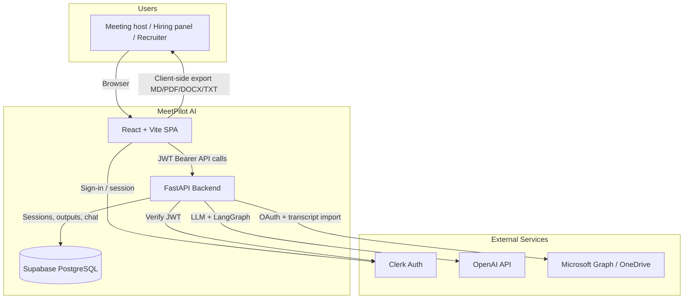
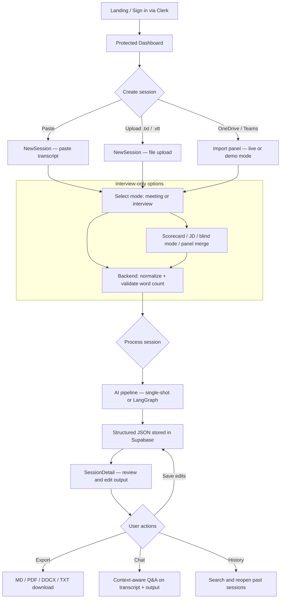
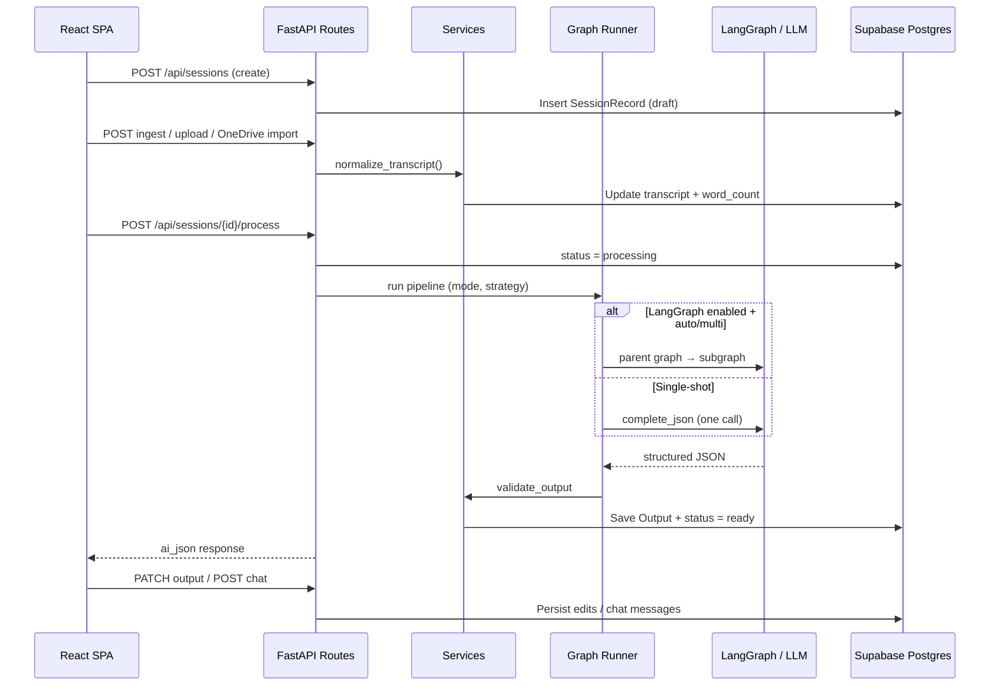
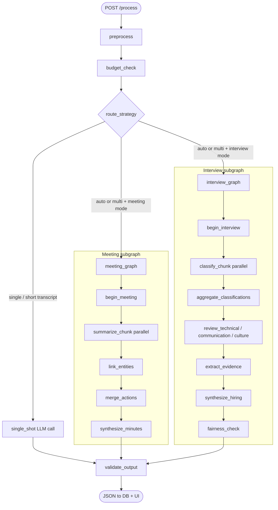
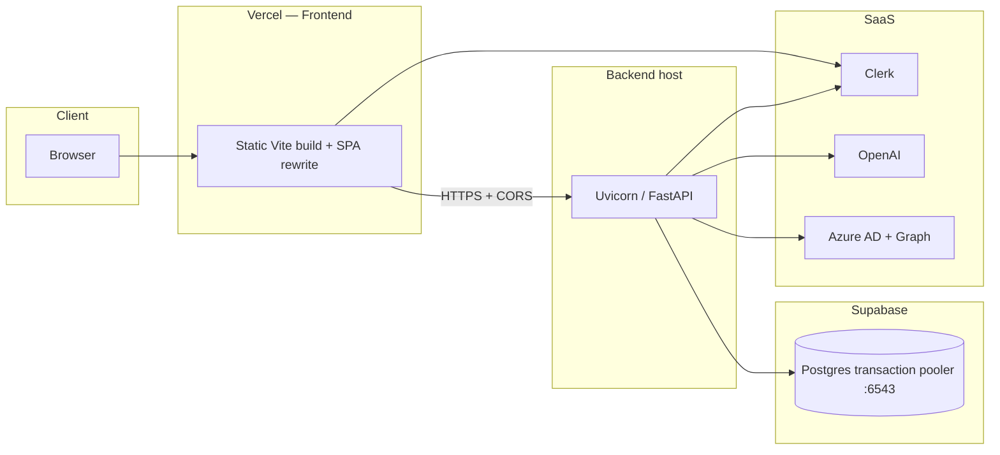
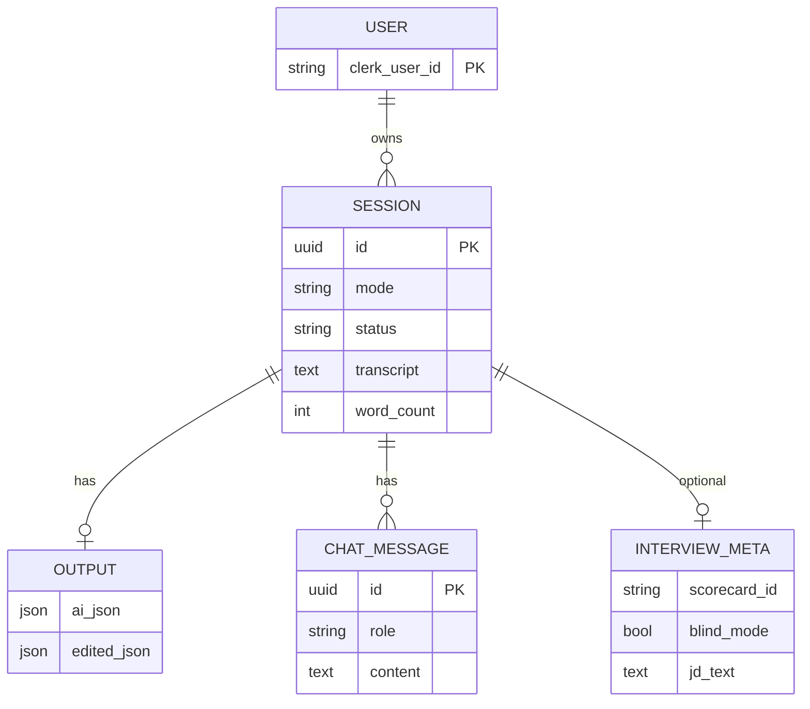

# Product / Technical Architecture Document

## Architecture Summary

MeetPilot AI is a two-tier web application:

- Frontend: React + Vite SPA with Clerk authentication and protected routes.
- Backend: FastAPI service exposing session, processing, import, and chat APIs.
- Data: Supabase PostgreSQL for users, sessions, outputs, metadata, and chat.
- AI: OpenAI-backed processing with optional LangGraph orchestration.
- Integrations: Clerk (auth), Microsoft Graph/OneDrive (transcript import), export toolchain (PDF/DOCX/MD/TXT).

**Related planning docs:** [PROJECT_PLAN.md](../../PROJECT_PLAN.md) (overall build) · [MULTI_AGENT_PLAN.md](../../MULTI_AGENT_PLAN.md) (LangGraph pipeline detail)

**Diagram index:** [System context](#system-context-diagram) · [End-to-end user flow](#end-to-end-user-flow) · [Backend processing flow](#backend-processing-flow) · [LangGraph pipeline](#langgraph-ai-pipeline) · [Deployment topology](#deployment-topology) · [Agentic dev loop](#agentic-development-loop)

---

## System Context Diagram

External systems and major MeetPilot components.

---

## End-to-End User Flow

Primary journey from sign-in through export and optional chat.

**Step summary**

1. User authenticates via Clerk.
2. User creates a session via paste, upload, or OneDrive/Teams import.
3. Backend normalizes the transcript and validates minimum input quality.
4. Processing runs in selected mode (`meeting` or `interview`).
5. Structured output JSON is stored and returned to the UI.
6. User edits output, exports, searches history, and optionally chats with session context.

---

## Backend Processing Flow

Request path from ingest through persistence.

**Route domains**

| Domain | Key routes | Responsibility |
|--------|------------|----------------|
| Sessions | `sessions.py` | CRUD, list, search, stats |
| Ingest | `ingest.py` | Upload, parse, normalize |
| Process | `process.py` | AI pipeline, output patch |
| Interview | `interview.py` | Scorecards, panel merge |
| Microsoft | `microsoft.py`, `onedrive.py` | OAuth, browse, import |
| Chat | `chat.py` | Session-context Q&A |

---

## LangGraph AI Pipeline

Optional multi-agent path when `LANGGRAPH_ENABLED=true` and routing selects a subgraph.

**Authoritative design reference:** [MULTI_AGENT_PLAN.md](../../MULTI_AGENT_PLAN.md) — when to use single vs multi-agent, design principles, `TranscriptState`, parent graph, meeting/interview subgraphs, FastAPI integration, and phased rollout (sections 1–8, 13–17).

**Routing rules (auto strategy)**

| Condition | Path |
|-----------|------|
| `strategy=single` | `single_shot` |
| `strategy=multi` | Mode-specific subgraph |
| `strategy=auto` + words ≥ `MULTI_WORD_THRESHOLD` (800) + multiple chunks | Subgraph |
| Interview + panel transcripts | `single_shot` (panel merge handled separately) |

### Processing modes

- **Meeting minutes** — summary, discussion points, decisions, action items, risks, follow-ups.
- **Interview feedback** — skills, strengths, concerns, communication, rating, follow-up questions.

### Prompting strategy

- Strict JSON output constraints.
- Transcript-grounded extraction only.
- Stable key schema for frontend rendering and editing.

---

## Deployment Topology

Production-style layout (Vercel + hosted API + Supabase).

| Layer | Technology | Production URL |
|-------|------------|----------------|
| Frontend | Vercel | https://pbmeetpilotai.vercel.app |
| Backend | Vercel (FastAPI) | https://talentserv-ai-hackathon-group-9-bac.vercel.app |
| Database | Supabase Postgres | Pooler URL in env (port `6543` for serverless) |
| Config | Environment variables | No secrets in repo |

See [07-SOURCE_CODE_AND_DEPLOYMENT_DETAILS.md](./07-SOURCE_CODE_AND_DEPLOYMENT_DETAILS.md) for setup commands and env keys.

---

---

## Frontend Architecture

- Framework: React 19 + Vite 8 + Tailwind.
- Routing: React Router with `ProtectedRoute`.
- Auth integration: Clerk provider + tokenized API requests.
- Major pages:
  - `Landing`, `SignIn`, `SignUp`
  - `Dashboard`, `NewSession`, `SessionDetail`, `History`
- Key components:
  - Teams import panel (live/demo mode).
  - Interview options panel.
  - Output editors and export bar.
  - Privacy disclosure banner.

---

## Backend Architecture

- Framework: FastAPI + SQLAlchemy + Pydantic.
- Auth: Clerk JWT verification (`issuer` + `jwks`).
- Session domain:
  - Session CRUD/list/search/stats.
  - Processing state transitions (`draft`, `processing`, `ready`, `error`).
- Processing domain:
  - `process` endpoint + structured output persistence.
  - Interview metadata persistence (scorecard/JD/blind mode).
- Integrations domain:
  - Microsoft OAuth + OneDrive browse/import.
  - Teams legacy alias routes for compatibility.
- Chat domain:
  - Session-context question-answer exchange with persistence.

## AI Agent / Pipeline Architecture

### Processing Modes

- Meeting minutes extraction.
- Interview feedback extraction.

### Orchestration Paths

- Single-shot path: one model call for shorter transcripts.
- Multi-agent path (LangGraph enabled):
  - Meeting: chunk summarize in parallel -> merge entities/actions -> synthesize.
  - Interview: classify chunks -> specialist reviews (technical/communication/culture) -> synthesis -> fairness check.

## Data Model (Conceptual)

- User (mapped to Clerk identity).
- SessionRecord (title, mode, source, transcript, status, word_count).
- Output (ai_json, edited_json).
- Interview metadata (JD text, scorecard id, blind mode, candidate identifiers).
- Chat messages per session.

---

## Security and Privacy Controls

- Third-party auth only (no custom password storage).
- Token-based protected API access.
- UI privacy banner and consent warning for AI-processed transcripts.
- Blind mode with PII redaction pathway for interview analysis.
- Demo mode support for integration failures to avoid unsafe workarounds.

---

## Key Design Decisions

- Chosen Clerk to reduce auth implementation risk and speed delivery.
- Chosen structured JSON outputs for deterministic UI rendering and export.
- Added LangGraph only as optional toggle to preserve fallback reliability.
- Added mock Teams/OneDrive mode to keep demo unblocked without full Azure setup.
- Defined Cursor agents/skills at repo kickoff so AI-assisted work follows the same phase loop as human delivery (see agentic loop above).
